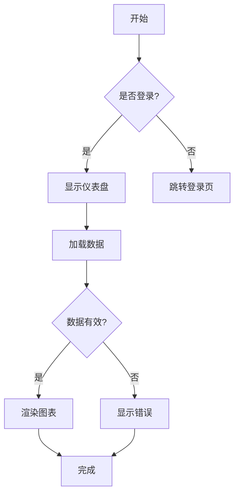
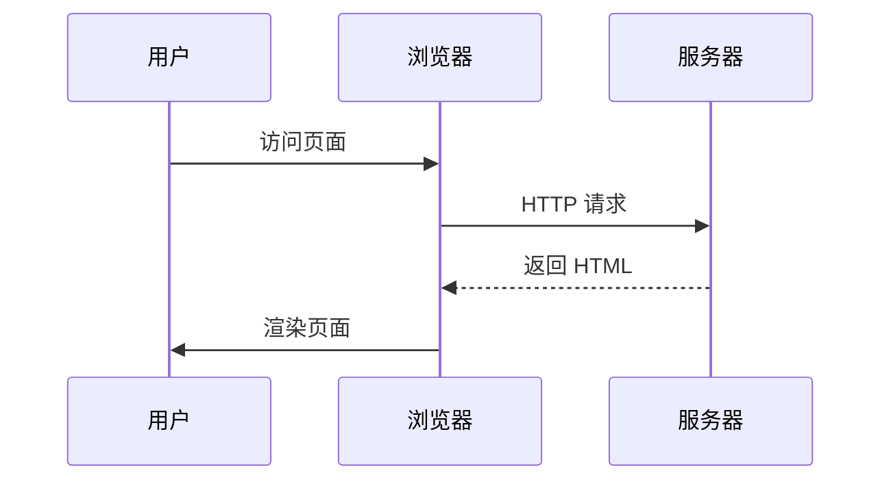
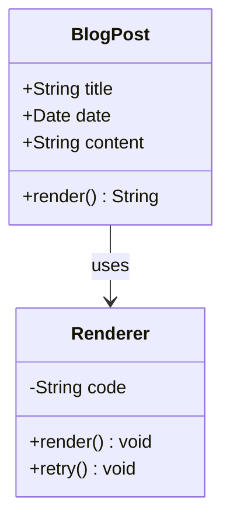
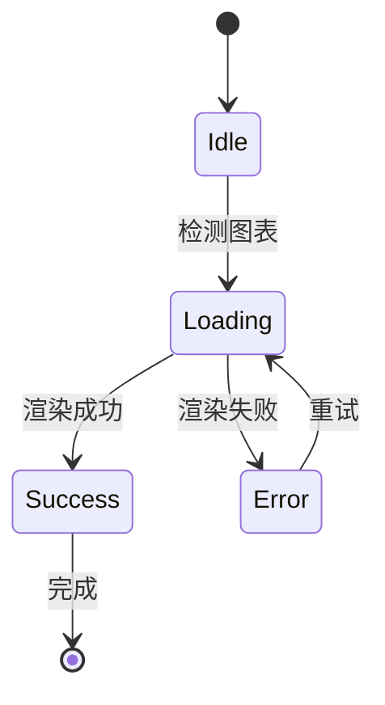
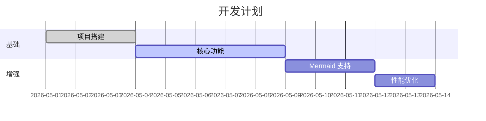
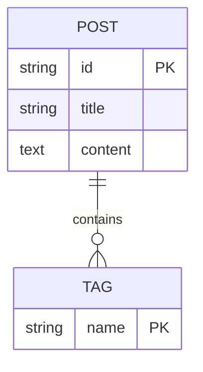
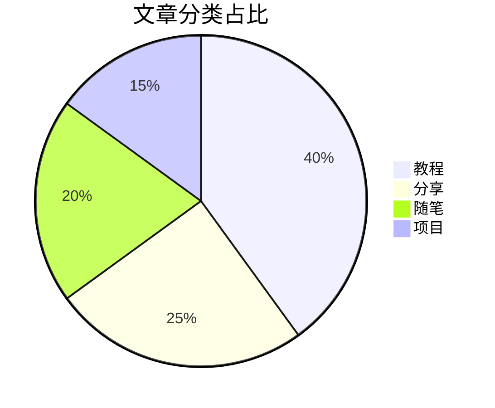
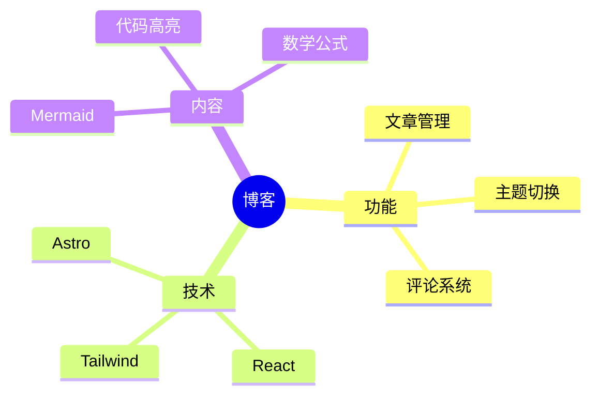
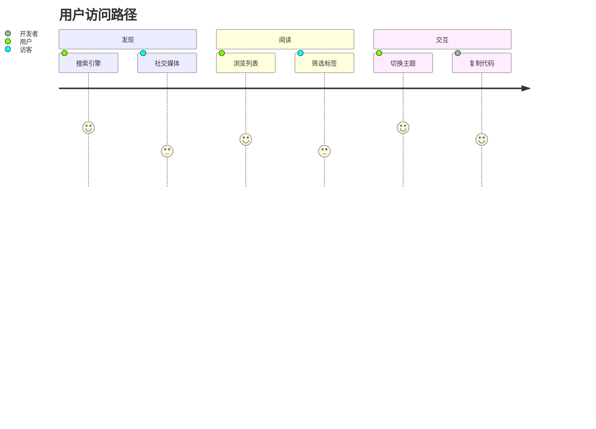
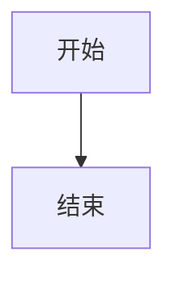

## Mermaid 图表功能演示

本文展示博客支持的 Mermaid 图表类型。每个示例包含**源码**和**渲染效果**对照。

---

### 流程图 (Flowchart)

**源码**：

````

````

**渲染效果**：


---

### 时序图 (Sequence Diagram)

**源码**：

````

````

**渲染效果**：


---

### 类图 (Class Diagram)

**源码**：

````

````

**渲染效果**：


---

### 状态图 (State Diagram)

**源码**：

````

````

**渲染效果**：


---

### 甘特图 (Gantt Chart)

**源码**：

````

````

**渲染效果**：


---

### ER 图 (Entity Relationship)

**源码**：

````

````

**渲染效果**：


---

### 饼图 (Pie Chart)

**源码**：

````

````

**渲染效果**：


---

### 思维导图 (Mindmap)

**源码**：

````

````

**渲染效果**：


---

### 用户旅程 (User Journey)

**源码**：

````

````

**渲染效果**：


---

## 使用方法

在 Markdown 中创建 Mermaid 图表：

````

````

图表会在页面加载时自动渲染，支持：

- **主题适配**：自动跟随博客明暗主题
- **复制源码**：悬停右上角点击复制
- **缩放图表**：右下角 +/- 按钮缩放
- **错误处理**：渲染失败时显示错误信息和重试按钮

更多语法参考 [Mermaid 官方文档](https://mermaid.js.org/intro/)
